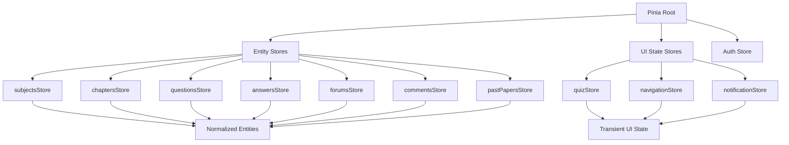

# Design Document: SA Learner Assistant Frontend

## Overview

The SA Learner Assistant Frontend is a Nuxt.js-based single-page application designed to help South African learners (grades 8-12) access educational content, practice questions, take quizzes, and engage in community forums. The application integrates with a RESTful backend API to provide subject browsing, chapter content viewing, interactive quizzing with immediate feedback, past paper access, and forum discussions. The frontend uses Vuetify for UI components, Pinia for state management, and implements role-based access control to separate public learner features from administrative content management capabilities.

The application follows a normalized state architecture with entity-based stores, implements optimistic UI updates for better user experience, and provides comprehensive CRUD interfaces for administrators to manage grades, subjects, chapters, questions, answers, past papers, and forum moderation.

## Architecture

```mermaid
graph TD
    A[Nuxt.js App] --> B[Pages Layer]
    A --> C[Components Layer]
    A --> D[Composables Layer]
    A --> E[Pinia Stores]
    A --> F[API Service Layer]
    
    B --> B1[Public Pages]
    B --> B2[Admin Pages]
    B --> B3[Auth Pages]
    
    C --> C1[UI Components]
    C --> C2[Feature Components]
    C --> C3[Admin Components]
    
    E --> E1[Entity Stores]
    E --> E2[UI State Stores]
    E --> E3[Auth Store]
    
    F --> G[Backend REST API]
    
    E1 --> E1A[subjects]
    E1 --> E1B[chapters]
    E1 --> E1C[questions]
    E1 --> E1D[forums]
    
    E2 --> E2A[quiz]
    E2 --> E2B[navigation]
    
    G --> G1[Subjects API]
    G --> G2[Chapters API]
    G --> G3[Questions API]
    G --> G4[Quiz API]
    G --> G5[Forums API]
    G --> G6[Auth API]


## Main Application Flow

```mermaid
sequenceDiagram
    participant U as User
    participant P as Page Component
    participant S as Pinia Store
    participant A as API Service
    participant B as Backend API
    
    U->>P: Navigate to /quiz/:chapterId
    P->>S: dispatch fetchQuizQuestions(chapterId)
    S->>A: getQuizByChapter(chapterId)
    A->>B: GET /Quiz/by-chapter/{chapterId}
    B-->>A: QuizQuestionDto[]
    A-->>S: questions data
    S->>S: normalize and store questions
    S-->>P: quiz state updated
    P-->>U: render quiz interface
    
    U->>P: select answers and submit
    P->>S: dispatch submitQuiz(submission)
    S->>A: submitQuiz(QuizSubmissionDto)
    A->>B: POST /Quiz/submit
    B-->>A: QuizResultDto
    A-->>S: quiz results
    S->>S: store results
    S-->>P: results state updated
    P-->>U: show quiz results with feedback


## Components and Interfaces

### Component 1: QuizRunner

**Purpose**: Orchestrates the quiz-taking experience, presenting questions one at a time or all at once, collecting user answers with validation based on MaxSelections, and submitting to the backend.

**Interface**:
```javascript
// Props
{
  chapterId: String,  // required
  mode: String        // 'sequential' | 'all-at-once', default: 'all-at-once'
}

// Emits
{
  'quiz-complete': (result) => void,
  'quiz-exit': () => void
}

// Exposed Methods
{
  resetQuiz: () => void,
  submitQuiz: () => Promise<void>
}
```

**Responsibilities**:
- Fetch quiz questions for the given chapter on mount
- Render question cards with answer options (radio for single-select, checkboxes for multi-select)
- Validate answer selections against MaxSelections constraint
- Collect all answers into QuizSubmissionDto format
- Submit quiz and handle loading/error states
- Display quiz results using QuizResult component

### Component 2: QuestionCard

**Purpose**: Displays a single question with its answer options, handles user selection, and enforces selection constraints.

**Interface**:
```javascript
// Props
{
  question: Object,           // QuizQuestionDto
  modelValue: Array,          // selected options (v-model)
  disabled: Boolean,          // default: false
  showCorrectAnswer: Boolean, // default: false
  correctOptions: Array       // for result display
}

// Emits
{
  'update:modelValue': (selectedOptions) => void
}
```

**Responsibilities**:
- Render question text and point value
- Display answer options as radio buttons (MaxSelections=1) or checkboxes (MaxSelections>1)
- Enforce MaxSelections limit on checkbox selection
- Show visual feedback for correct/incorrect answers when showCorrectAnswer is true
- Handle disabled state for submitted quizzes

### Component 3: ChapterContentRenderer

**Purpose**: Recursively renders chapter sections with nested structure, supporting rich text content, images, and hierarchical navigation.

**Interface**:
```javascript
// Props
{
  sections: Array,      // ChapterSection[]
  depth: Number,        // default: 0, for styling nested levels
  expandAll: Boolean    // default: false
}

// Emits
{
  'section-click': (sectionId) => void
}
```

**Responsibilities**:
- Render section titles with appropriate heading levels based on depth
- Display section content (HTML/markdown) with proper sanitization
- Render embedded images from section ImageUrl
- Recursively render child sections with increased depth
- Provide expand/collapse functionality for nested sections
- Generate table of contents navigation

### Component 4: AdminTable

**Purpose**: Generic reusable data table for admin CRUD operations with sorting, filtering, pagination, and action buttons.

**Interface**:
```javascript
// Props
{
  items: Array,           // data rows
  headers: Array,         // column definitions
  loading: Boolean,       // default: false
  itemsPerPage: Number,   // default: 10
  showActions: Boolean,   // default: true
  customActions: Array    // additional action buttons
}

// Emits
{
  'edit': (item) => void,
  'delete': (item) => void,
  'custom-action': (actionName, item) => void,
  'page-change': (page) => void
}
```

**Responsibilities**:
- Render Vuetify data table with provided headers and items
- Implement client-side sorting and filtering
- Provide pagination controls
- Render action column with edit/delete buttons
- Support custom action buttons per row
- Handle loading skeleton state

### Component 5: QuestionEditor

**Purpose**: Form component for creating and editing questions with dynamic answer option management based on question type.

**Interface**:
```javascript
// Props
{
  modelValue: Object,     // Question object (v-model)
  questionTypes: Array,   // available question types
  mode: String            // 'create' | 'edit'
}

// Emits
{
  'update:modelValue': (question) => void,
  'save': (question) => void,
  'cancel': () => void
}
```

**Responsibilities**:
- Render form fields for question text, point value, chapter selection
- Provide question type selector (Multiple Choice vs True/False)
- Dynamically show/hide MaxSelections field for MC questions
- For MC: render dynamic list of option inputs with add/remove buttons
- Validate required fields before save
- Emit save event with complete question data


## Data Models

### QuizQuestionDto

```javascript
{
  id: String,              // UUID
  questionText: String,
  pointValue: Number,      // integer
  options: Array,          // string[] - answer choices
  maxSelections: Number,   // integer - 1 for single-select, >1 for multi-select
  questionTypeId: String   // UUID
}
```

**Validation Rules**:
- id must be valid UUID
- questionText is required, non-empty string
- pointValue must be positive integer
- options array must have at least 2 items for MC questions
- maxSelections must be >= 1 and <= options.length

### QuizSubmissionDto

```javascript
{
  chapterId: String,       // UUID
  answers: Array           // AnswerSubmission[]
}

// AnswerSubmission
{
  questionId: String,      // UUID
  selectedOptions: Array   // string[] - optional, user's selected answer(s)
}
```

**Validation Rules**:
- chapterId must be valid UUID
- answers array is required
- each answer must have valid questionId
- selectedOptions can be empty (unanswered) or contain valid option strings
- selectedOptions length must not exceed question's maxSelections

### QuizResultDto

```javascript
{
  totalScore: Number,         // integer - points earned
  maxScore: Number,           // integer - total possible points
  questionResults: Array      // QuestionResult[]
}

// QuestionResult
{
  questionId: String,         // UUID
  isCorrect: Boolean,
  awardedPoints: Number,      // integer
  correctOptions: Array       // string[] - the correct answer(s)
}
```

**Validation Rules**:
- totalScore must be >= 0 and <= maxScore
- maxScore must be positive integer
- questionResults array corresponds to submitted questions
- awardedPoints must be >= 0 and <= question's pointValue

### SubjectDto

```javascript
{
  id: String,                 // UUID
  name: String,
  description: String,
  gradeId: String,            // UUID
  yearId: String,             // UUID
  textbookUrl: String,        // optional
  imageUrl: String,           // optional
  chapters: Array             // Chapter[] - optional, populated on detail fetch
}
```

**Validation Rules**:
- id, name, gradeId, yearId are required
- name must be non-empty string
- URLs must be valid HTTP/HTTPS if provided

### ChapterDto

```javascript
{
  id: String,                 // UUID
  title: String,
  subjectId: String,          // UUID
  chapterNumber: Number,      // integer
  sections: Array,            // ChapterSection[] - nested structure
  questions: Array            // Question[] - optional
}
```

**Validation Rules**:
- id, title, subjectId are required
- chapterNumber must be positive integer
- sections can be empty array or contain nested ChapterSection objects

### ChapterSectionDto

```javascript
{
  id: String,                 // UUID
  title: String,
  content: String,            // HTML or markdown
  imageUrl: String,           // optional
  orderIndex: Number,         // integer - for sorting
  parentSectionId: String,    // UUID - optional, null for root sections
  childSections: Array        // ChapterSection[] - recursive structure
}
```

**Validation Rules**:
- id, title are required
- content should be sanitized HTML
- orderIndex must be non-negative integer
- childSections can be empty or contain nested sections

### ForumDto

```javascript
{
  id: String,                 // UUID
  title: String,
  description: String,
  userId: String,             // UUID - creator
  createdAt: String,          // ISO 8601 datetime
  comments: Array,            // Comment[]
  tags: Array                 // string[] - optional
}
```

**Validation Rules**:
- id, title, userId, createdAt are required
- title must be non-empty string
- createdAt must be valid ISO 8601 datetime

### CommentDto

```javascript
{
  id: String,                 // UUID
  forumId: String,            // UUID
  userId: String,             // UUID
  content: String,
  screenshotUrl: String,      // optional
  createdAt: String,          // ISO 8601 datetime
  parentCommentId: String,    // UUID - optional, for replies
  replies: Array,             // Comment[] - nested replies
  reactions: Array            // UserReaction[]
}
```

**Validation Rules**:
- id, forumId, userId, content, createdAt are required
- content must be non-empty string
- screenshotUrl must be valid URL if provided
- replies can be empty or contain nested Comment objects


## Algorithmic Pseudocode

### Main Quiz Submission Algorithm

```javascript
/**
 * Submits quiz answers and processes results
 * 
 * @param {String} chapterId - UUID of the chapter
 * @param {Map} answersMap - Map of questionId -> selectedOptions[]
 * @returns {Promise<QuizResultDto>} Quiz results with scoring
 */
async function submitQuizWorkflow(chapterId, answersMap) {
  // Preconditions:
  // - chapterId is valid UUID
  // - answersMap contains entries for all questions
  // - each selectedOptions array respects maxSelections constraint
  
  // Step 1: Transform answers map to submission format
  const answers = []
  for (const [questionId, selectedOptions] of answersMap.entries()) {
    answers.push({
      questionId: questionId,
      selectedOptions: selectedOptions
    })
  }
  
  // Step 2: Create submission DTO
  const submission = {
    chapterId: chapterId,
    answers: answers
  }
  
  // Step 3: Validate submission
  if (!validateQuizSubmission(submission)) {
    throw new Error('Invalid quiz submission')
  }
  
  // Step 4: Submit to backend
  const result = await apiService.submitQuiz(submission)
  
  // Step 5: Store results in state
  quizStore.setQuizResult(result)
  
  // Step 6: Update question entities with correct answers
  for (const questionResult of result.questionResults) {
    questionStore.updateQuestionCorrectness(
      questionResult.questionId,
      questionResult.isCorrect,
      questionResult.correctOptions
    )
  }
  
  // Postconditions:
  // - result contains totalScore, maxScore, and per-question results
  // - quiz state is updated with results
  // - question entities are marked with correctness
  
  return result
}
```

**Preconditions:**
- chapterId is a valid UUID string
- answersMap is a Map object with questionId keys and selectedOptions array values
- All questions in the quiz have entries in answersMap (can be empty arrays for unanswered)
- Each selectedOptions array length does not exceed the question's maxSelections value

**Postconditions:**
- Returns QuizResultDto with totalScore, maxScore, and questionResults array
- Quiz store contains the latest quiz result
- Question entities are updated with correctness information
- If API call fails, error is thrown and state remains unchanged

**Loop Invariants:**
- During answer transformation loop: all processed answers have valid questionId and selectedOptions
- During result processing loop: all processed question results are stored in question entities

### Answer Selection Validation Algorithm

```javascript
/**
 * Validates and updates answer selection for a question
 * 
 * @param {String} questionId - UUID of the question
 * @param {String} optionValue - The option being toggled
 * @param {Array} currentSelections - Currently selected options
 * @param {Number} maxSelections - Maximum allowed selections
 * @returns {Array} Updated selections array
 */
function updateAnswerSelection(questionId, optionValue, currentSelections, maxSelections) {
  // Preconditions:
  // - questionId is valid UUID
  // - optionValue is non-empty string
  // - currentSelections is array of strings
  // - maxSelections is positive integer
  
  const selections = [...currentSelections]
  const optionIndex = selections.indexOf(optionValue)
  
  // Step 1: Check if option is already selected
  if (optionIndex !== -1) {
    // Option is selected, remove it (deselect)
    selections.splice(optionIndex, 1)
    return selections
  }
  
  // Step 2: Option is not selected, check if we can add it
  if (maxSelections === 1) {
    // Single selection mode: replace existing selection
    return [optionValue]
  }
  
  // Step 3: Multi-selection mode
  if (selections.length < maxSelections) {
    // Can add more selections
    selections.push(optionValue)
    return selections
  }
  
  // Step 4: Already at max selections, cannot add more
  // Return unchanged selections
  return selections
  
  // Postconditions:
  // - returned array length <= maxSelections
  // - if maxSelections === 1, returned array has exactly 0 or 1 element
  // - optionValue is either added or removed based on current state
}
```

**Preconditions:**
- questionId is a valid UUID string
- optionValue is a non-empty string matching one of the question's options
- currentSelections is an array of strings (can be empty)
- maxSelections is a positive integer >= 1

**Postconditions:**
- Returns a new array (does not mutate input)
- Returned array length is <= maxSelections
- If maxSelections is 1, returned array has 0 or 1 elements
- If optionValue was in currentSelections, it is removed
- If optionValue was not in currentSelections and space available, it is added
- If at max capacity, original selections are returned unchanged

**Loop Invariants:** N/A (no loops in this function)

### Chapter Content Rendering Algorithm

```javascript
/**
 * Recursively renders chapter sections with nested structure
 * 
 * @param {Array} sections - Array of ChapterSection objects
 * @param {Number} depth - Current nesting depth (0 for root)
 * @returns {Array} Array of rendered VNode elements
 */
function renderChapterSections(sections, depth = 0) {
  // Preconditions:
  // - sections is array of ChapterSection objects
  // - depth is non-negative integer
  // - each section has id, title, content, orderIndex
  
  if (!sections || sections.length === 0) {
    return []
  }
  
  // Step 1: Sort sections by orderIndex
  const sortedSections = [...sections].sort((a, b) => a.orderIndex - b.orderIndex)
  
  const renderedSections = []
  
  // Step 2: Render each section
  for (const section of sortedSections) {
    // Loop invariant: all previously rendered sections are valid VNodes
    
    // Step 2a: Determine heading level (h1-h6, max at h6)
    const headingLevel = Math.min(depth + 1, 6)
    
    // Step 2b: Create section container
    const sectionNode = {
      id: section.id,
      heading: createHeading(headingLevel, section.title),
      content: sanitizeAndRenderHTML(section.content),
      image: section.imageUrl ? createImage(section.imageUrl) : null,
      children: []
    }
    
    // Step 2c: Recursively render child sections
    if (section.childSections && section.childSections.length > 0) {
      sectionNode.children = renderChapterSections(section.childSections, depth + 1)
    }
    
    renderedSections.push(sectionNode)
  }
  
  // Postconditions:
  // - returned array contains rendered section nodes
  // - sections are sorted by orderIndex
  // - nested sections are rendered with increased depth
  // - heading levels are capped at h6
  
  return renderedSections
}
```

**Preconditions:**
- sections is an array of ChapterSection objects (can be empty)
- depth is a non-negative integer representing current nesting level
- Each section object has required fields: id, title, content, orderIndex
- childSections property, if present, is an array of ChapterSection objects

**Postconditions:**
- Returns an array of rendered section node objects
- Sections are sorted by orderIndex in ascending order
- Each section node contains heading, content, optional image, and children array
- Heading levels are calculated as depth + 1, capped at 6
- Child sections are recursively rendered with depth + 1
- Empty sections array returns empty array

**Loop Invariants:**
- All previously processed sections in the loop have valid rendered nodes
- All rendered nodes maintain proper heading level hierarchy
- orderIndex sorting is preserved throughout recursion

### Forum Comment Tree Building Algorithm

```javascript
/**
 * Builds nested comment tree from flat comment array
 * 
 * @param {Array} comments - Flat array of Comment objects
 * @returns {Array} Root-level comments with nested replies
 */
function buildCommentTree(comments) {
  // Preconditions:
  // - comments is array of Comment objects
  // - each comment has id, parentCommentId (nullable)
  
  if (!comments || comments.length === 0) {
    return []
  }
  
  // Step 1: Create lookup map for O(1) access
  const commentMap = new Map()
  for (const comment of comments) {
    commentMap.set(comment.id, { ...comment, replies: [] })
  }
  
  // Step 2: Build tree structure
  const rootComments = []
  
  for (const comment of comments) {
    // Loop invariant: all processed comments are either in rootComments or attached as replies
    
    const commentNode = commentMap.get(comment.id)
    
    if (!comment.parentCommentId) {
      // Root-level comment
      rootComments.push(commentNode)
    } else {
      // Reply to another comment
      const parentNode = commentMap.get(comment.parentCommentId)
      if (parentNode) {
        parentNode.replies.push(commentNode)
      } else {
        // Parent not found, treat as root comment
        rootComments.push(commentNode)
      }
    }
  }
  
  // Step 3: Sort comments by createdAt (newest first)
  const sortByDate = (a, b) => new Date(b.createdAt) - new Date(a.createdAt)
  
  rootComments.sort(sortByDate)
  
  // Recursively sort replies
  function sortReplies(comment) {
    if (comment.replies.length > 0) {
      comment.replies.sort(sortByDate)
      for (const reply of comment.replies) {
        sortReplies(reply)
      }
    }
  }
  
  for (const comment of rootComments) {
    sortReplies(comment)
  }
  
  // Postconditions:
  // - returned array contains only root-level comments
  // - each comment has replies array with nested comments
  // - comments are sorted by createdAt (newest first) at all levels
  
  return rootComments
}
```

**Preconditions:**
- comments is an array of Comment objects (can be empty)
- Each comment has id (UUID) and parentCommentId (UUID or null)
- Each comment has createdAt (ISO 8601 datetime string)
- Comment IDs are unique within the array

**Postconditions:**
- Returns array of root-level comments (parentCommentId is null)
- Each comment has a replies array containing nested child comments
- Comments at all levels are sorted by createdAt in descending order (newest first)
- Orphaned comments (parent not found) are treated as root comments
- Original comments array is not mutated

**Loop Invariants:**
- During tree building: all processed comments are either in rootComments or attached to their parent's replies
- During sorting: all previously sorted comment levels maintain descending createdAt order


## Key Functions with Formal Specifications

### Function 1: fetchQuizQuestions()

```javascript
async function fetchQuizQuestions(chapterId)
```

**Preconditions:**
- chapterId is a valid UUID string
- User has network connectivity
- Backend API is accessible

**Postconditions:**
- Returns array of QuizQuestionDto objects for the chapter
- Quiz store is populated with normalized question entities
- UI state reflects loading completion
- If chapter has no questions, returns empty array
- On error, throws exception and state remains unchanged

**Loop Invariants:** N/A

### Function 2: normalizeQuestions()

```javascript
function normalizeQuestions(questions)
```

**Preconditions:**
- questions is an array of QuizQuestionDto objects
- Each question has a unique id property

**Postconditions:**
- Returns object with questions keyed by id: { [id]: QuizQuestionDto }
- Original questions array is not mutated
- All questions from input array are present in output object
- Duplicate IDs (if any) result in later entries overwriting earlier ones

**Loop Invariants:**
- All previously processed questions are stored in the result object with their id as key

### Function 3: validateQuizSubmission()

```javascript
function validateQuizSubmission(submission)
```

**Preconditions:**
- submission is an object with chapterId and answers properties
- answers is an array of answer objects

**Postconditions:**
- Returns boolean: true if submission is valid, false otherwise
- Validation checks: chapterId is UUID, answers is non-empty array, each answer has questionId
- No side effects on input parameter
- Does not throw exceptions

**Loop Invariants:**
- All previously validated answers in the loop passed validation checks

### Function 4: sanitizeHTML()

```javascript
function sanitizeHTML(htmlContent)
```

**Preconditions:**
- htmlContent is a string (can be empty)

**Postconditions:**
- Returns sanitized HTML string safe for rendering
- Removes potentially dangerous tags: script, iframe, object, embed
- Removes event handler attributes: onclick, onerror, etc.
- Preserves safe formatting tags: p, div, span, h1-h6, ul, ol, li, strong, em, img
- Empty input returns empty string
- No side effects on input parameter

**Loop Invariants:** N/A (implementation-dependent)

### Function 5: calculateQuizScore()

```javascript
function calculateQuizScore(questionResults)
```

**Preconditions:**
- questionResults is an array of QuestionResult objects
- Each result has awardedPoints property (non-negative integer)

**Postconditions:**
- Returns object: { totalScore: Number, maxScore: Number, percentage: Number }
- totalScore is sum of all awardedPoints
- maxScore is sum of all question point values
- percentage is (totalScore / maxScore) * 100, or 0 if maxScore is 0
- No side effects on input parameter

**Loop Invariants:**
- Running totalScore sum is accurate for all processed results

### Function 6: uploadForumScreenshot()

```javascript
async function uploadForumScreenshot(file)
```

**Preconditions:**
- file is a File object (image type)
- file.size is within allowed limit (e.g., 5MB)
- file.type is an allowed image MIME type (image/jpeg, image/png, image/gif)

**Postconditions:**
- Returns URL string of uploaded screenshot
- File is uploaded to backend storage
- On validation failure, throws descriptive error
- On upload failure, throws network error
- No partial uploads (atomic operation)

**Loop Invariants:** N/A

### Function 7: debounceSearch()

```javascript
function debounceSearch(searchTerm, delay = 300)
```

**Preconditions:**
- searchTerm is a string (can be empty)
- delay is a positive integer (milliseconds)

**Postconditions:**
- Returns a Promise that resolves after delay milliseconds
- If called again before delay expires, previous timer is cancelled
- Only the most recent call within delay window executes search
- Empty searchTerm clears search results immediately

**Loop Invariants:** N/A

### Function 8: formatDateTime()

```javascript
function formatDateTime(isoString, locale = 'en-ZA')
```

**Preconditions:**
- isoString is a valid ISO 8601 datetime string
- locale is a valid BCP 47 language tag

**Postconditions:**
- Returns formatted datetime string in specified locale
- For South African locale (en-ZA): "DD/MM/YYYY HH:mm" format
- Invalid isoString returns "Invalid Date"
- No side effects on input parameter

**Loop Invariants:** N/A

### Function 9: checkUserRole()

```javascript
function checkUserRole(requiredRole)
```

**Preconditions:**
- requiredRole is a string ('admin', 'user', etc.)
- Auth store contains current user information

**Postconditions:**
- Returns boolean: true if user has required role, false otherwise
- If user is not authenticated, returns false
- Role check is case-insensitive
- No side effects on auth state

**Loop Invariants:** N/A

### Function 10: cacheInvalidation()

```javascript
function cacheInvalidation(entityType, entityId = null)
```

**Preconditions:**
- entityType is a valid entity type string ('subjects', 'chapters', 'questions', etc.)
- entityId is a UUID string or null (null invalidates all entities of type)

**Postconditions:**
- If entityId is provided, removes that specific entity from cache
- If entityId is null, clears all entities of the specified type
- Cache timestamps are updated
- Subsequent fetches will retrieve fresh data from API
- No effect on other entity types

**Loop Invariants:** N/A


## State Management Architecture

### Pinia Store Structure



### Entity Store Pattern

```javascript
// Example: questionsStore
{
  state: () => ({
    entities: {},           // { [id]: QuestionDto }
    ids: [],               // ordered array of question IDs
    loading: false,
    error: null,
    lastFetch: null,       // timestamp for cache invalidation
    byChapter: {}          // { [chapterId]: questionIds[] }
  }),
  
  getters: {
    // Get question by ID
    getById: (state) => (id) => state.entities[id],
    
    // Get questions for a chapter
    getByChapter: (state) => (chapterId) => {
      const questionIds = state.byChapter[chapterId] || []
      return questionIds.map(id => state.entities[id]).filter(Boolean)
    },
    
    // Check if data is stale (older than 5 minutes)
    isStale: (state) => {
      if (!state.lastFetch) return true
      return Date.now() - state.lastFetch > 5 * 60 * 1000
    }
  },
  
  actions: {
    // Fetch questions for a chapter
    async fetchByChapter(chapterId) {
      // Check cache first
      if (this.byChapter[chapterId] && !this.isStale) {
        return this.getByChapter(chapterId)
      }
      
      this.loading = true
      this.error = null
      
      try {
        const questions = await apiService.getQuestionsByChapter(chapterId)
        this.setQuestions(questions, chapterId)
        return questions
      } catch (error) {
        this.error = error.message
        throw error
      } finally {
        this.loading = false
      }
    },
    
    // Normalize and store questions
    setQuestions(questions, chapterId) {
      const questionIds = []
      
      for (const question of questions) {
        this.entities[question.id] = question
        questionIds.push(question.id)
        
        if (!this.ids.includes(question.id)) {
          this.ids.push(question.id)
        }
      }
      
      this.byChapter[chapterId] = questionIds
      this.lastFetch = Date.now()
    },
    
    // Invalidate cache for a chapter
    invalidateChapter(chapterId) {
      delete this.byChapter[chapterId]
      this.lastFetch = null
    }
  }
}
```

### Quiz Store (UI State)

```javascript
{
  state: () => ({
    currentChapterId: null,
    questionIds: [],           // IDs of questions in current quiz
    answers: {},               // { [questionId]: selectedOptions[] }
    result: null,              // QuizResultDto after submission
    currentQuestionIndex: 0,   // for sequential mode
    isSubmitting: false,
    isComplete: false
  }),
  
  getters: {
    // Get current quiz questions from questions store
    currentQuestions: (state) => {
      const questionsStore = useQuestionsStore()
      return state.questionIds
        .map(id => questionsStore.getById(id))
        .filter(Boolean)
    },
    
    // Check if all questions are answered
    allAnswered: (state) => {
      return state.questionIds.every(id => 
        state.answers[id] && state.answers[id].length > 0
      )
    },
    
    // Calculate progress percentage
    progressPercentage: (state) => {
      const answered = Object.keys(state.answers).filter(
        id => state.answers[id] && state.answers[id].length > 0
      ).length
      return (answered / state.questionIds.length) * 100
    }
  },
  
  actions: {
    // Initialize quiz for a chapter
    async startQuiz(chapterId) {
      const questionsStore = useQuestionsStore()
      const questions = await questionsStore.fetchByChapter(chapterId)
      
      this.currentChapterId = chapterId
      this.questionIds = questions.map(q => q.id)
      this.answers = {}
      this.result = null
      this.currentQuestionIndex = 0
      this.isComplete = false
    },
    
    // Update answer for a question
    setAnswer(questionId, selectedOptions) {
      this.answers[questionId] = selectedOptions
    },
    
    // Submit quiz
    async submitQuiz() {
      this.isSubmitting = true
      
      try {
        const submission = {
          chapterId: this.currentChapterId,
          answers: this.questionIds.map(id => ({
            questionId: id,
            selectedOptions: this.answers[id] || []
          }))
        }
        
        const result = await apiService.submitQuiz(submission)
        this.result = result
        this.isComplete = true
        return result
      } catch (error) {
        throw error
      } finally {
        this.isSubmitting = false
      }
    },
    
    // Reset quiz state
    resetQuiz() {
      this.$reset()
    }
  }
}
```

### Auth Store

```javascript
{
  state: () => ({
    user: null,              // Current user object
    token: null,             // JWT token
    isAuthenticated: false,
    loading: false,
    error: null
  }),
  
  getters: {
    // Check if user has admin role
    isAdmin: (state) => {
      return state.user?.roles?.includes('admin') || false
    },
    
    // Get user display name
    displayName: (state) => {
      return state.user?.username || 'Guest'
    }
  },
  
  actions: {
    // Login
    async login(credentials) {
      this.loading = true
      this.error = null
      
      try {
        const response = await apiService.login(credentials)
        this.user = response.user
        this.token = response.token
        this.isAuthenticated = true
        
        // Store token in localStorage
        localStorage.setItem('auth_token', response.token)
        
        return response
      } catch (error) {
        this.error = error.message
        throw error
      } finally {
        this.loading = false
      }
    },
    
    // Logout
    logout() {
      this.user = null
      this.token = null
      this.isAuthenticated = false
      localStorage.removeItem('auth_token')
    },
    
    // Restore session from localStorage
    async restoreSession() {
      const token = localStorage.getItem('auth_token')
      if (!token) return false
      
      try {
        const user = await apiService.verifyToken(token)
        this.user = user
        this.token = token
        this.isAuthenticated = true
        return true
      } catch (error) {
        this.logout()
        return false
      }
    }
  }
}
```


## API Service Layer

### API Service Architecture

```javascript
// composables/useApi.js
export function useApi() {
  const config = useRuntimeConfig()
  const authStore = useAuthStore()
  
  const baseURL = config.public.apiBaseUrl
  
  // Create axios instance with interceptors
  const client = axios.create({
    baseURL,
    timeout: 10000,
    headers: {
      'Content-Type': 'application/json'
    }
  })
  
  // Request interceptor: add auth token
  client.interceptors.request.use(
    (config) => {
      if (authStore.token) {
        config.headers.Authorization = `Bearer ${authStore.token}`
      }
      return config
    },
    (error) => Promise.reject(error)
  )
  
  // Response interceptor: handle errors
  client.interceptors.response.use(
    (response) => response.data,
    (error) => {
      if (error.response?.status === 401) {
        authStore.logout()
        navigateTo('/login')
      }
      return Promise.reject(error)
    }
  )
  
  return {
    // Subjects
    getSubjects: () => client.get('/Subjects'),
    getSubject: (id) => client.get(`/Subjects/${id}`),
    getSubjectsByGrade: (gradeId) => client.get(`/Subjects/Grade?gradeId=${gradeId}`),
    
    // Chapters
    getChapters: () => client.get('/Chapters'),
    getChapter: (id) => client.get(`/Chapters/${id}`),
    createChapter: (data) => client.post('/Chapters', data),
    updateChapter: (id, data) => client.put(`/Chapters/${id}`, data),
    deleteChapter: (id) => client.delete(`/Chapters/${id}`),
    
    // Questions
    getQuestion: (id) => client.get(`/Questions/${id}`),
    getQuestionsByChapter: (chapterId) => client.get(`/Questions/by-chapter/${chapterId}`),
    createQuestion: (data) => client.post('/Questions', data),
    updateQuestion: (id, data) => client.put(`/Questions/${id}`, data),
    deleteQuestion: (id) => client.delete(`/Questions/${id}`),
    
    // Answers
    getAnswer: (id) => client.get(`/Answers/${id}`),
    getAnswersByQuestion: (questionId) => client.get(`/Answers/by-question/${questionId}`),
    createMultipleChoiceAnswer: (data) => client.post('/Answers/multiple-choice', data),
    createTrueFalseAnswer: (data) => client.post('/Answers/true-false', data),
    
    // Quiz
    getQuizByChapter: (chapterId) => client.get(`/Quiz/by-chapter/${chapterId}`),
    submitQuiz: (submission) => client.post('/Quiz/submit', submission),
    
    // Forums
    getForums: () => client.get('/Forums'),
    getForum: (id) => client.get(`/Forums/${id}`),
    createForum: (data) => client.post('/Forums', data),
    updateForum: (id, data) => client.put(`/Forums/${id}`, data),
    deleteForum: (id) => client.delete(`/Forums/${id}`),
    
    // Past Papers
    getPastPapers: (subjectId) => client.get(`/PastPapers/${subjectId}`),
    
    // Auth
    login: (credentials) => client.post('/Auth/login', credentials),
    register: (userData) => client.post('/Auth/register', userData),
    verifyToken: (token) => client.get('/Auth/verify', {
      headers: { Authorization: `Bearer ${token}` }
    })
  }
}
```

### Error Handling Strategy

```javascript
// composables/useErrorHandler.js
export function useErrorHandler() {
  const notificationStore = useNotificationStore()
  
  function handleApiError(error, context = '') {
    let message = 'An unexpected error occurred'
    
    if (error.response) {
      // Server responded with error status
      switch (error.response.status) {
        case 400:
          message = error.response.data?.message || 'Invalid request'
          break
        case 401:
          message = 'Authentication required'
          break
        case 403:
          message = 'Access denied'
          break
        case 404:
          message = 'Resource not found'
          break
        case 500:
          message = 'Server error. Please try again later'
          break
        default:
          message = error.response.data?.message || message
      }
    } else if (error.request) {
      // Request made but no response
      message = 'Network error. Please check your connection'
    }
    
    if (context) {
      message = `${context}: ${message}`
    }
    
    notificationStore.showError(message)
    
    // Log to console in development
    if (process.env.NODE_ENV === 'development') {
      console.error('API Error:', error)
    }
    
    return message
  }
  
  return {
    handleApiError
  }
}
```


## Routing Structure

### Route Configuration

```javascript
// Nuxt.js pages directory structure
pages/
├── index.vue                          // Home / subject list
├── subjects/
│   ├── index.vue                      // Subject catalog
│   └── [id].vue                       // Subject detail
├── chapters/
│   ├── [id].vue                       // Chapter content view
│   └── [id]/
│       └── questions.vue              // Questions list for chapter
├── questions/
│   └── [id].vue                       // Question practice view
├── quiz/
│   └── [chapterId].vue                // Quiz runner
├── forums/
│   ├── index.vue                      // Forum list
│   └── [id].vue                       // Forum thread view
├── past-papers/
│   └── [subjectId].vue                // Past papers list
├── videos/
│   └── [subjectId].vue                // Video tutorials
├── login.vue                          // Login page
├── register.vue                       // Register page
├── profile.vue                        // User profile
└── admin/
    ├── index.vue                      // Admin dashboard
    ├── grades.vue                     // Manage grades
    ├── subjects.vue                   // Manage subjects
    ├── chapters.vue                   // Manage chapters
    ├── questions/
    │   ├── index.vue                  // Question list
    │   └── [id]/
    │       └── answers.vue            // Manage answers
    ├── papers.vue                     // Manage past papers
    ├── forums.vue                     // Moderate forums
    └── users.vue                      // Manage users
```

### Route Guards

```javascript
// middleware/auth.js
export default defineNuxtRouteMiddleware((to, from) => {
  const authStore = useAuthStore()
  
  // Check if route requires authentication
  if (to.meta.requiresAuth && !authStore.isAuthenticated) {
    return navigateTo('/login')
  }
  
  // Check if route requires admin role
  if (to.meta.requiresAdmin && !authStore.isAdmin) {
    return navigateTo('/')
  }
})

// middleware/guest.js
export default defineNuxtRouteMiddleware((to, from) => {
  const authStore = useAuthStore()
  
  // Redirect authenticated users away from login/register
  if (authStore.isAuthenticated) {
    return navigateTo('/')
  }
})
```

### Page Meta Configuration

```javascript
// pages/admin/index.vue
definePageMeta({
  middleware: 'auth',
  requiresAdmin: true,
  layout: 'admin'
})

// pages/login.vue
definePageMeta({
  middleware: 'guest',
  layout: 'auth'
})

// pages/quiz/[chapterId].vue
definePageMeta({
  middleware: 'auth',
  layout: 'fullscreen'
})
```


## Example Usage

### Example 1: Taking a Quiz

```javascript
// pages/quiz/[chapterId].vue
<script setup>
import { ref, computed, onMounted } from 'vue'
import { useRoute, useRouter } from 'vue-router'
import { useQuizStore } from '~/stores/quiz'
import { useQuestionsStore } from '~/stores/questions'

const route = useRoute()
const router = useRouter()
const quizStore = useQuizStore()
const questionsStore = useQuestionsStore()

const chapterId = route.params.chapterId
const loading = ref(true)
const error = ref(null)

// Initialize quiz on mount
onMounted(async () => {
  try {
    await quizStore.startQuiz(chapterId)
  } catch (err) {
    error.value = err.message
  } finally {
    loading.value = false
  }
})

// Get current questions
const questions = computed(() => quizStore.currentQuestions)

// Handle answer selection
function handleAnswerChange(questionId, selectedOptions) {
  quizStore.setAnswer(questionId, selectedOptions)
}

// Submit quiz
async function submitQuiz() {
  try {
    const result = await quizStore.submitQuiz()
    // Quiz result is now in quizStore.result
  } catch (err) {
    error.value = 'Failed to submit quiz'
  }
}

// Check if quiz is complete
const isComplete = computed(() => quizStore.isComplete)
const result = computed(() => quizStore.result)
</script>

<template>
  <v-container>
    <v-progress-linear v-if="loading" indeterminate />
    
    <v-alert v-if="error" type="error">{{ error }}</v-alert>
    
    <div v-if="!loading && !isComplete">
      <h1>Quiz</h1>
      <v-progress-linear 
        :model-value="quizStore.progressPercentage" 
        color="primary"
        height="8"
        class="mb-4"
      />
      
      <QuestionCard
        v-for="question in questions"
        :key="question.id"
        :question="question"
        :model-value="quizStore.answers[question.id] || []"
        @update:model-value="handleAnswerChange(question.id, $event)"
        class="mb-4"
      />
      
      <v-btn
        color="primary"
        size="large"
        :disabled="!quizStore.allAnswered"
        :loading="quizStore.isSubmitting"
        @click="submitQuiz"
      >
        Submit Quiz
      </v-btn>
    </div>
    
    <QuizResult v-if="isComplete" :result="result" />
  </v-container>
</template>
```

### Example 2: Rendering Chapter Content

```javascript
// pages/chapters/[id].vue
<script setup>
import { ref, onMounted } from 'vue'
import { useRoute } from 'vue-router'
import { useChaptersStore } from '~/stores/chapters'

const route = useRoute()
const chaptersStore = useChaptersStore()

const chapterId = route.params.id
const chapter = ref(null)
const loading = ref(true)

onMounted(async () => {
  try {
    chapter.value = await chaptersStore.fetchById(chapterId)
  } catch (err) {
    console.error('Failed to load chapter:', err)
  } finally {
    loading.value = false
  }
})
</script>

<template>
  <v-container>
    <v-skeleton-loader v-if="loading" type="article" />
    
    <div v-else-if="chapter">
      <h1>{{ chapter.title }}</h1>
      
      <ChapterContentRenderer 
        :sections="chapter.sections"
        @section-click="handleSectionClick"
      />
      
      <v-divider class="my-6" />
      
      <v-btn
        color="primary"
        :to="`/chapters/${chapterId}/questions`"
      >
        Practice Questions
      </v-btn>
      
      <v-btn
        color="secondary"
        :to="`/quiz/${chapterId}`"
        class="ml-2"
      >
        Take Quiz
      </v-btn>
    </div>
  </v-container>
</template>
```

### Example 3: Admin Question Management

```javascript
// pages/admin/questions/index.vue
<script setup>
import { ref, onMounted } from 'vue'
import { useQuestionsStore } from '~/stores/questions'
import { useRouter } from 'vue-router'

definePageMeta({
  middleware: 'auth',
  requiresAdmin: true
})

const questionsStore = useQuestionsStore()
const router = useRouter()

const questions = ref([])
const loading = ref(true)
const showEditor = ref(false)
const editingQuestion = ref(null)

const headers = [
  { title: 'Question Text', key: 'questionText' },
  { title: 'Chapter', key: 'chapterTitle' },
  { title: 'Points', key: 'pointValue' },
  { title: 'Type', key: 'questionType' },
  { title: 'Actions', key: 'actions', sortable: false }
]

onMounted(async () => {
  await loadQuestions()
})

async function loadQuestions() {
  loading.value = true
  try {
    questions.value = await questionsStore.fetchAll()
  } finally {
    loading.value = false
  }
}

function handleEdit(question) {
  editingQuestion.value = { ...question }
  showEditor.value = true
}

async function handleDelete(question) {
  if (confirm('Delete this question?')) {
    try {
      await questionsStore.deleteQuestion(question.id)
      await loadQuestions()
    } catch (err) {
      console.error('Failed to delete question:', err)
    }
  }
}

async function handleSave(question) {
  try {
    if (question.id) {
      await questionsStore.updateQuestion(question.id, question)
    } else {
      await questionsStore.createQuestion(question)
    }
    showEditor.value = false
    await loadQuestions()
  } catch (err) {
    console.error('Failed to save question:', err)
  }
}

function handleCancel() {
  showEditor.value = false
  editingQuestion.value = null
}

function createNew() {
  editingQuestion.value = {
    questionText: '',
    pointValue: 1,
    chapterId: null,
    questionTypeId: null,
    options: [],
    maxSelections: 1
  }
  showEditor.value = true
}
</script>

<template>
  <v-container>
    <v-row>
      <v-col>
        <h1>Manage Questions</h1>
      </v-col>
      <v-col class="text-right">
        <v-btn color="primary" @click="createNew">
          <v-icon left>mdi-plus</v-icon>
          New Question
        </v-btn>
      </v-col>
    </v-row>
    
    <AdminTable
      :items="questions"
      :headers="headers"
      :loading="loading"
      @edit="handleEdit"
      @delete="handleDelete"
    />
    
    <v-dialog v-model="showEditor" max-width="800">
      <QuestionEditor
        v-model="editingQuestion"
        :mode="editingQuestion?.id ? 'edit' : 'create'"
        @save="handleSave"
        @cancel="handleCancel"
      />
    </v-dialog>
  </v-container>
</template>
```

### Example 4: Forum Thread with Comments

```javascript
// pages/forums/[id].vue
<script setup>
import { ref, computed, onMounted } from 'vue'
import { useRoute } from 'vue-router'
import { useForumsStore } from '~/stores/forums'
import { useCommentsStore } from '~/stores/comments'
import { useAuthStore } from '~/stores/auth'

const route = useRoute()
const forumsStore = useForumsStore()
const commentsStore = useCommentsStore()
const authStore = useAuthStore()

const forumId = route.params.id
const forum = ref(null)
const comments = ref([])
const loading = ref(true)
const newComment = ref('')
const screenshotFile = ref(null)

onMounted(async () => {
  try {
    forum.value = await forumsStore.fetchById(forumId)
    const flatComments = await commentsStore.fetchByForum(forumId)
    // Build comment tree
    comments.value = buildCommentTree(flatComments)
  } finally {
    loading.value = false
  }
})

function buildCommentTree(flatComments) {
  const commentMap = new Map()
  flatComments.forEach(comment => {
    commentMap.set(comment.id, { ...comment, replies: [] })
  })
  
  const rootComments = []
  flatComments.forEach(comment => {
    const node = commentMap.get(comment.id)
    if (!comment.parentCommentId) {
      rootComments.push(node)
    } else {
      const parent = commentMap.get(comment.parentCommentId)
      if (parent) {
        parent.replies.push(node)
      }
    }
  })
  
  return rootComments
}

async function handleCommentSubmit() {
  if (!newComment.value.trim()) return
  
  try {
    let screenshotUrl = null
    if (screenshotFile.value) {
      screenshotUrl = await uploadScreenshot(screenshotFile.value)
    }
    
    await commentsStore.createComment({
      forumId: forumId,
      content: newComment.value,
      screenshotUrl: screenshotUrl
    })
    
    // Reload comments
    const flatComments = await commentsStore.fetchByForum(forumId)
    comments.value = buildCommentTree(flatComments)
    
    // Reset form
    newComment.value = ''
    screenshotFile.value = null
  } catch (err) {
    console.error('Failed to post comment:', err)
  }
}

async function uploadScreenshot(file) {
  const formData = new FormData()
  formData.append('file', file)
  const response = await useApi().uploadFile(formData)
  return response.url
}
</script>

<template>
  <v-container>
    <v-skeleton-loader v-if="loading" type="article" />
    
    <div v-else-if="forum">
      <h1>{{ forum.title }}</h1>
      <p>{{ forum.description }}</p>
      
      <v-divider class="my-4" />
      
      <CommentList :comments="comments" />
      
      <v-card v-if="authStore.isAuthenticated" class="mt-4">
        <v-card-text>
          <v-textarea
            v-model="newComment"
            label="Add a comment"
            rows="3"
          />
          
          <v-file-input
            v-model="screenshotFile"
            label="Attach screenshot (optional)"
            accept="image/*"
            prepend-icon="mdi-camera"
          />
          
          <v-btn
            color="primary"
            :disabled="!newComment.trim()"
            @click="handleCommentSubmit"
          >
            Post Comment
          </v-btn>
        </v-card-text>
      </v-card>
      
      <v-alert v-else type="info" class="mt-4">
        Please log in to post comments
      </v-alert>
    </div>
  </v-container>
</template>
```


## Correctness Properties

### Property 1: Quiz Answer Selection Constraint

**Universal Quantification:**
```
∀ question ∈ Quiz, ∀ userSelection ∈ Answers:
  |userSelection.selectedOptions| ≤ question.maxSelections
```

**Description:** For all questions in a quiz, the number of options selected by the user must never exceed the question's maxSelections value. This ensures single-select questions (maxSelections=1) only allow one answer, and multi-select questions respect their defined limits.

**Verification:** UI components enforce this constraint by disabling additional selections when the limit is reached, and validation occurs before submission.

### Property 2: Quiz Score Calculation Accuracy

**Universal Quantification:**
```
∀ quizResult ∈ QuizResults:
  quizResult.totalScore = Σ(questionResult.awardedPoints) ∧
  0 ≤ quizResult.totalScore ≤ quizResult.maxScore
```

**Description:** The total score in any quiz result must equal the sum of awarded points across all questions, and must be within the valid range of 0 to maxScore. This ensures scoring accuracy and prevents invalid score states.

**Verification:** Backend calculates scores; frontend validates the result structure and displays consistent totals.

### Property 3: Chapter Section Hierarchy Integrity

**Universal Quantification:**
```
∀ section ∈ ChapterSections:
  section.parentSectionId ≠ null ⟹ 
    ∃ parent ∈ ChapterSections: parent.id = section.parentSectionId ∧
    section ∉ ancestors(section)
```

**Description:** For all chapter sections with a parent, the parent must exist in the sections collection, and no section can be its own ancestor (preventing circular references). This ensures a valid tree structure for chapter content.

**Verification:** Backend enforces referential integrity; frontend rendering algorithm handles missing parents gracefully by treating orphaned sections as root-level.

### Property 4: Authentication State Consistency

**Universal Quantification:**
```
∀ state ∈ ApplicationStates:
  state.auth.isAuthenticated = true ⟺ 
    (state.auth.user ≠ null ∧ state.auth.token ≠ null)
```

**Description:** The authentication state is consistent if and only if isAuthenticated is true when both user and token are present, and false otherwise. This prevents inconsistent auth states.

**Verification:** Auth store actions maintain this invariant by setting all three properties atomically during login/logout operations.

### Property 5: Admin Route Access Control

**Universal Quantification:**
```
∀ route ∈ AdminRoutes, ∀ user ∈ Users:
  canAccess(user, route) ⟺ 
    (user.isAuthenticated ∧ 'admin' ∈ user.roles)
```

**Description:** A user can access admin routes if and only if they are authenticated and have the 'admin' role. This ensures proper authorization for administrative functions.

**Verification:** Route middleware checks both authentication and role before allowing navigation to admin pages.

### Property 6: Entity Cache Staleness

**Universal Quantification:**
```
∀ entityStore ∈ EntityStores:
  entityStore.isStale = true ⟺ 
    (entityStore.lastFetch = null ∨ 
     currentTime - entityStore.lastFetch > CACHE_TTL)
```

**Description:** An entity store's cache is considered stale if it has never been fetched or if the time since last fetch exceeds the cache time-to-live (TTL). This ensures data freshness.

**Verification:** Store getters compute staleness; actions check staleness before deciding whether to fetch from API or use cached data.

### Property 7: Comment Tree Structure Validity

**Universal Quantification:**
```
∀ comment ∈ Comments:
  comment.parentCommentId = null ⟺ comment ∈ rootComments ∧
  comment.parentCommentId ≠ null ⟹ 
    ∃ parent ∈ Comments: parent.id = comment.parentCommentId ∧
    comment ∈ parent.replies
```

**Description:** Comments with null parentCommentId are root-level comments, and comments with a parent ID must have that parent exist and include the comment in its replies array. This ensures a valid comment tree structure.

**Verification:** buildCommentTree algorithm constructs the tree structure, handling orphaned comments by treating them as root-level.

### Property 8: Form Validation Completeness

**Universal Quantification:**
```
∀ form ∈ Forms, ∀ field ∈ form.requiredFields:
  form.isValid = true ⟹ 
    (field.value ≠ null ∧ field.value ≠ '' ∧ 
     field.meetsConstraints = true)
```

**Description:** A form is valid only if all required fields have non-null, non-empty values that meet their specific constraints (e.g., email format, length limits). This ensures data quality before submission.

**Verification:** Form components use Vuetify validation rules; submit buttons are disabled until form.isValid is true.

### Property 9: API Request Idempotency for Safe Methods

**Universal Quantification:**
```
∀ request ∈ SafeHTTPMethods (GET, HEAD, OPTIONS):
  execute(request, n times) ≡ execute(request, 1 time)
```

**Description:** Safe HTTP methods (GET, HEAD, OPTIONS) are idempotent - executing them multiple times produces the same result as executing once. This ensures safe retry behavior and caching.

**Verification:** API service layer uses appropriate HTTP methods; GET requests are cacheable and can be safely retried on network errors.

### Property 10: Normalized State Consistency

**Universal Quantification:**
```
∀ entityStore ∈ EntityStores:
  entityStore.ids.length = |entityStore.entities| ∧
  ∀ id ∈ entityStore.ids: id ∈ keys(entityStore.entities)
```

**Description:** In normalized entity stores, the ids array length must equal the number of entities in the entities object, and every id in the ids array must exist as a key in the entities object. This ensures state consistency.

**Verification:** Store actions that modify entities also update the ids array atomically, maintaining the invariant.


## Error Handling

### Error Scenario 1: Network Failure During Quiz Submission

**Condition:** User submits quiz but network request fails (timeout, connection lost, server unreachable)

**Response:** 
- Display user-friendly error message: "Failed to submit quiz. Please check your connection and try again."
- Keep quiz state intact (answers are not lost)
- Provide "Retry" button to resubmit without re-answering questions
- Store submission in localStorage as backup

**Recovery:**
- User clicks retry button to resubmit
- If retry fails after 3 attempts, offer "Save Draft" option to store locally
- When connection restored, prompt user to submit saved draft

### Error Scenario 2: Invalid Authentication Token

**Condition:** User's JWT token expires or becomes invalid during session

**Response:**
- API interceptor detects 401 Unauthorized response
- Clear auth state (logout user)
- Redirect to login page with return URL parameter
- Display message: "Your session has expired. Please log in again."

**Recovery:**
- User logs in again
- Redirect to original page they were trying to access
- Restore any unsaved work from localStorage if applicable

### Error Scenario 3: Chapter Content Load Failure

**Condition:** Chapter data fails to load (404 not found, 500 server error, network timeout)

**Response:**
- Display error state in place of content
- Show appropriate message based on error type:
  - 404: "Chapter not found. It may have been removed."
  - 500: "Server error. Please try again later."
  - Network: "Failed to load chapter. Check your connection."
- Provide "Retry" button and "Go Back" button

**Recovery:**
- User clicks retry to attempt reload
- User clicks go back to return to subject/chapter list
- Cache any successfully loaded data to reduce re-fetch needs

### Error Scenario 4: File Upload Failure (Forum Screenshots)

**Condition:** Screenshot upload fails due to file size, type, or network issues

**Response:**
- Validate file before upload:
  - Check file size < 5MB
  - Check file type is image (jpeg, png, gif)
  - Display validation errors immediately
- If upload fails after validation:
  - Show error: "Failed to upload screenshot. Please try again."
  - Keep comment text intact
  - Allow user to remove screenshot and post without it

**Recovery:**
- User can retry upload
- User can remove screenshot and post comment without it
- User can save comment as draft with screenshot for later

### Error Scenario 5: Admin CRUD Operation Failure

**Condition:** Admin attempts to create/update/delete entity but operation fails

**Response:**
- Display specific error message from backend if available
- Generic fallback: "Failed to save changes. Please try again."
- Keep form data intact (don't clear on error)
- Highlight specific field errors if validation failed
- Show error notification with dismiss option

**Recovery:**
- User corrects validation errors and resubmits
- User clicks retry for network errors
- Changes are not applied to local state until confirmed by backend
- Optimistic updates are rolled back on error

### Error Scenario 6: Quiz Question Data Inconsistency

**Condition:** Quiz questions have invalid data (missing options, invalid maxSelections, etc.)

**Response:**
- Validate question data on load
- Skip invalid questions with console warning (dev mode)
- Display message: "Some questions could not be loaded"
- Allow quiz to proceed with valid questions only
- Report issue to error tracking service

**Recovery:**
- Admin is notified of data issues
- User can still complete quiz with available questions
- Score calculation adjusts for missing questions

### Error Scenario 7: Concurrent Edit Conflict

**Condition:** Two admins edit the same entity simultaneously

**Response:**
- Backend returns 409 Conflict status
- Display message: "This item was modified by another user. Please refresh and try again."
- Show "View Changes" button to see current version
- Offer to save user's changes as draft

**Recovery:**
- User refreshes to see latest version
- User manually merges their changes with latest version
- User's draft is preserved for reference

### Error Scenario 8: Browser Storage Quota Exceeded

**Condition:** localStorage or sessionStorage quota exceeded when caching data

**Response:**
- Catch QuotaExceededError exception
- Clear oldest cached data (LRU eviction)
- Retry storage operation
- If still fails, operate without cache
- Log warning to console

**Recovery:**
- Application continues to function without cache
- Data is fetched from API on each request
- User may experience slower performance but no data loss


## Testing Strategy

### Unit Testing Approach

**Framework:** Vitest with Vue Test Utils

**Coverage Goals:**
- Utility functions: 100% coverage
- Store actions and getters: 90% coverage
- Component logic: 80% coverage

**Key Test Cases:**

1. **Answer Selection Validation**
   - Test single-select constraint (maxSelections=1)
   - Test multi-select constraint (maxSelections>1)
   - Test deselection behavior
   - Test boundary conditions (selecting at max limit)

2. **Quiz Score Calculation**
   - Test correct score summation
   - Test percentage calculation
   - Test edge cases (all correct, all wrong, partial)
   - Test zero-point questions

3. **Comment Tree Building**
   - Test flat array to tree conversion
   - Test nested replies (multiple levels)
   - Test orphaned comments handling
   - Test sorting by date

4. **HTML Sanitization**
   - Test removal of script tags
   - Test removal of event handlers
   - Test preservation of safe tags
   - Test empty input handling

5. **Store State Management**
   - Test entity normalization
   - Test cache invalidation
   - Test optimistic updates and rollback
   - Test concurrent action handling

**Example Unit Test:**

```javascript
// tests/unit/utils/answerSelection.test.js
import { describe, it, expect } from 'vitest'
import { updateAnswerSelection } from '~/utils/answerSelection'

describe('updateAnswerSelection', () => {
  it('should add option when under max selections', () => {
    const result = updateAnswerSelection(
      'q1',
      'optionB',
      ['optionA'],
      2
    )
    expect(result).toEqual(['optionA', 'optionB'])
  })
  
  it('should replace option in single-select mode', () => {
    const result = updateAnswerSelection(
      'q1',
      'optionB',
      ['optionA'],
      1
    )
    expect(result).toEqual(['optionB'])
  })
  
  it('should remove option when already selected', () => {
    const result = updateAnswerSelection(
      'q1',
      'optionA',
      ['optionA', 'optionB'],
      2
    )
    expect(result).toEqual(['optionB'])
  })
  
  it('should not add option when at max selections', () => {
    const result = updateAnswerSelection(
      'q1',
      'optionC',
      ['optionA', 'optionB'],
      2
    )
    expect(result).toEqual(['optionA', 'optionB'])
  })
})
```

### Property-Based Testing Approach

**Framework:** fast-check (JavaScript property-based testing library)

**Property Test Library:** fast-check

**Key Properties to Test:**

1. **Quiz Answer Selection Invariant**
   - Property: Selected options length never exceeds maxSelections
   - Generator: Arbitrary questions with random maxSelections (1-5)
   - Generator: Arbitrary user selection sequences
   - Assertion: After any sequence of selections, constraint holds

2. **Comment Tree Acyclicity**
   - Property: Comment tree has no cycles
   - Generator: Arbitrary flat comment arrays with parent references
   - Assertion: buildCommentTree produces acyclic structure

3. **Score Calculation Commutativity**
   - Property: Score sum is independent of question order
   - Generator: Arbitrary question results arrays
   - Assertion: calculateQuizScore produces same total regardless of order

4. **HTML Sanitization Safety**
   - Property: Sanitized HTML contains no dangerous elements
   - Generator: Arbitrary HTML strings with mixed safe/unsafe content
   - Assertion: Output contains no script tags or event handlers

**Example Property Test:**

```javascript
// tests/property/answerSelection.property.test.js
import { describe, it } from 'vitest'
import fc from 'fast-check'
import { updateAnswerSelection } from '~/utils/answerSelection'

describe('Answer Selection Properties', () => {
  it('should never exceed maxSelections', () => {
    fc.assert(
      fc.property(
        fc.uuid(),                           // questionId
        fc.array(fc.string(), { minLength: 2, maxLength: 10 }), // options
        fc.integer({ min: 1, max: 5 }),     // maxSelections
        fc.array(fc.integer({ min: 0, max: 9 })) // selection sequence
      ),
      (questionId, options, maxSelections, selectionSequence) => {
        let currentSelections = []
        
        for (const index of selectionSequence) {
          const option = options[index % options.length]
          currentSelections = updateAnswerSelection(
            questionId,
            option,
            currentSelections,
            maxSelections
          )
          
          // Property: length never exceeds maxSelections
          expect(currentSelections.length).toBeLessThanOrEqual(maxSelections)
        }
      }
    )
  })
  
  it('should maintain idempotency for deselection', () => {
    fc.assert(
      fc.property(
        fc.uuid(),
        fc.string(),
        fc.array(fc.string()),
        fc.integer({ min: 1, max: 5 })
      ),
      (questionId, option, selections, maxSelections) => {
        // Add option
        const withOption = updateAnswerSelection(
          questionId,
          option,
          selections,
          maxSelections
        )
        
        // Remove option
        const withoutOption = updateAnswerSelection(
          questionId,
          option,
          withOption,
          maxSelections
        )
        
        // Remove again (idempotent)
        const stillWithout = updateAnswerSelection(
          questionId,
          option,
          withoutOption,
          maxSelections
        )
        
        // Property: removing twice is same as removing once
        expect(stillWithout).toEqual(withoutOption)
      }
    )
  })
})
```

### Integration Testing Approach

**Framework:** Playwright for E2E testing

**Key Integration Tests:**

1. **Complete Quiz Flow**
   - Navigate to quiz page
   - Load questions from API
   - Select answers for all questions
   - Submit quiz
   - Verify results display correctly
   - Verify score matches expected calculation

2. **Admin CRUD Operations**
   - Login as admin
   - Create new question
   - Edit question
   - Delete question
   - Verify changes persist across page refresh

3. **Forum Interaction Flow**
   - View forum thread
   - Post comment with screenshot
   - Reply to comment
   - Add reaction
   - Verify nested comment structure

4. **Authentication Flow**
   - Login with valid credentials
   - Access protected route
   - Token expiration handling
   - Logout and verify redirect

**Example Integration Test:**

```javascript
// tests/e2e/quiz.spec.js
import { test, expect } from '@playwright/test'

test.describe('Quiz Flow', () => {
  test('should complete quiz and show results', async ({ page }) => {
    // Login
    await page.goto('/login')
    await page.fill('[name="username"]', 'testuser')
    await page.fill('[name="password"]', 'password123')
    await page.click('button[type="submit"]')
    
    // Navigate to quiz
    await page.goto('/quiz/chapter-id-123')
    
    // Wait for questions to load
    await page.waitForSelector('.question-card')
    
    // Answer all questions
    const questions = await page.$$('.question-card')
    for (const question of questions) {
      const firstOption = await question.$('input[type="radio"], input[type="checkbox"]')
      await firstOption.check()
    }
    
    // Submit quiz
    await page.click('button:has-text("Submit Quiz")')
    
    // Verify results display
    await page.waitForSelector('.quiz-result')
    const score = await page.textContent('.total-score')
    expect(score).toMatch(/\d+/)
    
    // Verify per-question feedback
    const results = await page.$$('.question-result')
    expect(results.length).toBe(questions.length)
  })
})
```

### Component Testing Approach

**Framework:** Vitest + Vue Test Utils

**Key Component Tests:**

1. **QuestionCard Component**
   - Renders question text and options
   - Enforces selection constraints
   - Emits correct events on selection
   - Shows correct/incorrect feedback

2. **QuizRunner Component**
   - Loads questions on mount
   - Tracks answer state
   - Validates before submission
   - Displays results after submission

3. **ChapterContentRenderer Component**
   - Renders nested sections recursively
   - Applies correct heading levels
   - Handles missing images gracefully
   - Generates table of contents

**Example Component Test:**

```javascript
// tests/components/QuestionCard.test.js
import { describe, it, expect } from 'vitest'
import { mount } from '@vue/test-utils'
import QuestionCard from '~/components/QuestionCard.vue'

describe('QuestionCard', () => {
  const mockQuestion = {
    id: 'q1',
    questionText: 'What is 2+2?',
    pointValue: 5,
    options: ['3', '4', '5'],
    maxSelections: 1
  }
  
  it('should render question text', () => {
    const wrapper = mount(QuestionCard, {
      props: { question: mockQuestion, modelValue: [] }
    })
    expect(wrapper.text()).toContain('What is 2+2?')
  })
  
  it('should emit update on option selection', async () => {
    const wrapper = mount(QuestionCard, {
      props: { question: mockQuestion, modelValue: [] }
    })
    
    const radio = wrapper.find('input[type="radio"]')
    await radio.setValue(true)
    
    expect(wrapper.emitted('update:modelValue')).toBeTruthy()
    expect(wrapper.emitted('update:modelValue')[0]).toEqual([['4']])
  })
  
  it('should enforce single selection for maxSelections=1', async () => {
    const wrapper = mount(QuestionCard, {
      props: { 
        question: mockQuestion, 
        modelValue: ['3'] 
      }
    })
    
    // Select different option
    const radios = wrapper.findAll('input[type="radio"]')
    await radios[1].setValue(true)
    
    // Should replace previous selection
    const emitted = wrapper.emitted('update:modelValue')
    expect(emitted[emitted.length - 1]).toEqual([['4']])
  })
})
```


## Performance Considerations

### 1. Code Splitting and Lazy Loading

**Strategy:**
- Use Nuxt.js automatic code splitting for pages
- Lazy load admin components (only loaded when user accesses admin routes)
- Lazy load heavy components (QuizRunner, ChapterContentRenderer) with dynamic imports
- Split vendor bundles to improve caching

**Implementation:**
```javascript
// Lazy load admin components
const AdminTable = defineAsyncComponent(() => 
  import('~/components/admin/AdminTable.vue')
)

// Route-based code splitting (automatic with Nuxt pages)
// Each page in pages/ directory becomes a separate chunk
```

**Expected Impact:**
- Initial bundle size < 200KB (gzipped)
- Admin routes add ~100KB only when accessed
- Faster initial page load for learners

### 2. API Response Caching

**Strategy:**
- Cache GET requests in Pinia stores with TTL (5 minutes default)
- Use stale-while-revalidate pattern for better UX
- Implement cache invalidation on mutations (create/update/delete)
- Use HTTP cache headers for static assets

**Implementation:**
```javascript
// Store with cache TTL
const CACHE_TTL = 5 * 60 * 1000 // 5 minutes

getters: {
  isStale: (state) => {
    if (!state.lastFetch) return true
    return Date.now() - state.lastFetch > CACHE_TTL
  }
}

actions: {
  async fetchData() {
    // Return cached data if fresh
    if (!this.isStale) {
      return this.data
    }
    // Fetch fresh data
    const data = await api.getData()
    this.data = data
    this.lastFetch = Date.now()
    return data
  }
}
```

**Expected Impact:**
- Reduce API calls by 60-70% for repeated views
- Faster navigation between pages
- Lower server load

### 3. Virtual Scrolling for Large Lists

**Strategy:**
- Use virtual scrolling for question lists, forum threads, and admin tables
- Render only visible items + buffer
- Implement with vue-virtual-scroller or Vuetify's virtual scroll

**Implementation:**
```javascript
// Virtual scroll for large question lists
<v-virtual-scroll
  :items="questions"
  :item-height="120"
  height="600"
>
  <template v-slot:default="{ item }">
    <QuestionCard :question="item" />
  </template>
</v-virtual-scroll>
```

**Expected Impact:**
- Handle 1000+ items without performance degradation
- Constant memory usage regardless of list size
- Smooth scrolling experience

### 4. Image Optimization

**Strategy:**
- Use Nuxt Image module for automatic optimization
- Lazy load images below the fold
- Serve responsive images (srcset) for different screen sizes
- Use WebP format with JPEG fallback
- Implement progressive image loading (blur-up)

**Implementation:**
```javascript
// Optimized image component
<nuxt-img
  :src="chapter.imageUrl"
  :alt="chapter.title"
  loading="lazy"
  format="webp"
  sizes="sm:100vw md:50vw lg:400px"
  placeholder
/>
```

**Expected Impact:**
- 50-70% reduction in image file sizes
- Faster page load times
- Better mobile experience

### 5. Debouncing and Throttling

**Strategy:**
- Debounce search inputs (300ms delay)
- Throttle scroll events for infinite scroll
- Debounce auto-save for draft comments

**Implementation:**
```javascript
// Debounced search
import { useDebounceFn } from '@vueuse/core'

const debouncedSearch = useDebounceFn((searchTerm) => {
  performSearch(searchTerm)
}, 300)
```

**Expected Impact:**
- Reduce unnecessary API calls by 80-90%
- Smoother user experience
- Lower server load

### 6. Optimistic UI Updates

**Strategy:**
- Update UI immediately on user actions (like, comment, answer selection)
- Rollback on API error
- Show loading indicators only for slow operations (>500ms)

**Implementation:**
```javascript
async function addReaction(commentId, reactionType) {
  // Optimistic update
  const tempReaction = { id: 'temp', commentId, reactionType, userId: currentUser.id }
  commentsStore.addReaction(tempReaction)
  
  try {
    const reaction = await api.addReaction(commentId, reactionType)
    // Replace temp with real reaction
    commentsStore.replaceReaction('temp', reaction)
  } catch (error) {
    // Rollback on error
    commentsStore.removeReaction('temp')
    showError('Failed to add reaction')
  }
}
```

**Expected Impact:**
- Perceived performance improvement (instant feedback)
- Better user experience
- Reduced perceived latency

### 7. Bundle Size Optimization

**Strategy:**
- Tree-shake unused Vuetify components
- Use lightweight alternatives for simple utilities (date-fns instead of moment.js)
- Analyze bundle with webpack-bundle-analyzer
- Remove unused dependencies

**Implementation:**
```javascript
// nuxt.config.js
export default {
  vuetify: {
    treeShake: true,
    customVariables: ['~/assets/variables.scss']
  },
  build: {
    analyze: process.env.ANALYZE === 'true'
  }
}
```

**Expected Impact:**
- 30-40% reduction in bundle size
- Faster initial load
- Better mobile performance

### 8. Service Worker for Offline Support

**Strategy:**
- Cache static assets (JS, CSS, images) with service worker
- Cache API responses for offline viewing
- Implement background sync for quiz submissions
- Use workbox for service worker generation

**Implementation:**
```javascript
// nuxt.config.js
export default {
  pwa: {
    workbox: {
      runtimeCaching: [
        {
          urlPattern: '/api/.*',
          handler: 'NetworkFirst',
          options: {
            cacheName: 'api-cache',
            expiration: {
              maxEntries: 50,
              maxAgeSeconds: 5 * 60 // 5 minutes
            }
          }
        }
      ]
    }
  }
}
```

**Expected Impact:**
- Offline viewing of previously loaded content
- Reliable quiz submission even with poor connectivity
- Better mobile experience in areas with unstable internet

### Performance Metrics Goals

| Metric | Target | Measurement |
|--------|--------|-------------|
| First Contentful Paint (FCP) | < 1.5s | Lighthouse |
| Largest Contentful Paint (LCP) | < 2.5s | Lighthouse |
| Time to Interactive (TTI) | < 3.5s | Lighthouse |
| Total Blocking Time (TBT) | < 300ms | Lighthouse |
| Cumulative Layout Shift (CLS) | < 0.1 | Lighthouse |
| Bundle Size (initial) | < 200KB | webpack-bundle-analyzer |
| API Response Time (p95) | < 500ms | Backend monitoring |


## Security Considerations

### 1. Authentication and Authorization

**Threats:**
- Unauthorized access to admin routes
- Token theft and replay attacks
- Session hijacking

**Mitigations:**
- Use HTTP-only cookies for token storage (preferred) or secure localStorage
- Implement JWT with short expiration (1 hour) and refresh tokens
- Validate user roles on both frontend (UX) and backend (security)
- Use route guards to prevent unauthorized navigation
- Implement CSRF protection for state-changing operations

**Implementation:**
```javascript
// Secure token storage
const authStore = useAuthStore()

// Store token in HTTP-only cookie (backend sets it)
// Or use secure localStorage with encryption
function storeToken(token) {
  if (process.client) {
    // Encrypt token before storing
    const encrypted = encryptToken(token)
    localStorage.setItem('auth_token', encrypted)
  }
}

// Route guard with role check
middleware: [
  async (to, from) => {
    if (to.meta.requiresAdmin) {
      const authStore = useAuthStore()
      if (!authStore.isAdmin) {
        return navigateTo('/')
      }
    }
  }
]
```

### 2. XSS (Cross-Site Scripting) Prevention

**Threats:**
- Malicious scripts in user-generated content (forum posts, comments)
- Script injection through chapter content
- Event handler injection in HTML content

**Mitigations:**
- Sanitize all HTML content before rendering
- Use Vue's built-in XSS protection (v-html escaping)
- Implement Content Security Policy (CSP) headers
- Whitelist allowed HTML tags and attributes
- Remove all event handlers from user content

**Implementation:**
```javascript
// HTML sanitization utility
import DOMPurify from 'dompurify'

function sanitizeHTML(html) {
  return DOMPurify.sanitize(html, {
    ALLOWED_TAGS: ['p', 'div', 'span', 'h1', 'h2', 'h3', 'h4', 'h5', 'h6', 
                   'ul', 'ol', 'li', 'strong', 'em', 'u', 'br', 'img', 'a'],
    ALLOWED_ATTR: ['href', 'src', 'alt', 'title', 'class'],
    ALLOW_DATA_ATTR: false
  })
}

// CSP headers in nuxt.config.js
export default {
  render: {
    csp: {
      hashAlgorithm: 'sha256',
      policies: {
        'default-src': ["'self'"],
        'script-src': ["'self'", "'unsafe-inline'"],
        'style-src': ["'self'", "'unsafe-inline'"],
        'img-src': ["'self'", 'data:', 'https:'],
        'font-src': ["'self'", 'data:'],
        'connect-src': ["'self'", process.env.API_BASE_URL]
      }
    }
  }
}
```

### 3. CSRF (Cross-Site Request Forgery) Protection

**Threats:**
- Unauthorized state-changing requests from malicious sites
- Form submission hijacking

**Mitigations:**
- Use CSRF tokens for all POST/PUT/DELETE requests
- Validate Origin and Referer headers
- Use SameSite cookie attribute
- Implement double-submit cookie pattern

**Implementation:**
```javascript
// CSRF token in API requests
const csrfToken = useCookie('csrf-token')

client.interceptors.request.use((config) => {
  if (['post', 'put', 'delete'].includes(config.method)) {
    config.headers['X-CSRF-Token'] = csrfToken.value
  }
  return config
})
```

### 4. Input Validation

**Threats:**
- SQL injection (backend concern, but validate on frontend too)
- Command injection
- Path traversal
- Invalid data causing application errors

**Mitigations:**
- Validate all user inputs on frontend before submission
- Use schema validation (Zod, Yup) for form data
- Sanitize file names for uploads
- Limit file sizes and types
- Validate UUIDs and other identifiers

**Implementation:**
```javascript
// Form validation with Zod
import { z } from 'zod'

const questionSchema = z.object({
  questionText: z.string().min(10).max(1000),
  pointValue: z.number().int().positive().max(100),
  chapterId: z.string().uuid(),
  options: z.array(z.string().min(1)).min(2).max(10),
  maxSelections: z.number().int().positive()
})

function validateQuestion(data) {
  try {
    questionSchema.parse(data)
    return { valid: true }
  } catch (error) {
    return { valid: false, errors: error.errors }
  }
}

// File upload validation
function validateUpload(file) {
  const maxSize = 5 * 1024 * 1024 // 5MB
  const allowedTypes = ['image/jpeg', 'image/png', 'image/gif']
  
  if (file.size > maxSize) {
    throw new Error('File too large (max 5MB)')
  }
  
  if (!allowedTypes.includes(file.type)) {
    throw new Error('Invalid file type')
  }
  
  return true
}
```

### 5. Secure File Uploads

**Threats:**
- Malicious file uploads (malware, scripts)
- File type spoofing
- Path traversal in file names

**Mitigations:**
- Validate file types on both client and server
- Scan uploaded files for malware (backend)
- Store files outside web root
- Use random file names (UUIDs)
- Serve files through CDN with proper headers

**Implementation:**
```javascript
// Secure file upload
async function uploadScreenshot(file) {
  // Validate file
  validateUpload(file)
  
  // Create FormData
  const formData = new FormData()
  formData.append('file', file)
  
  // Upload with progress tracking
  const response = await api.uploadFile(formData, {
    onUploadProgress: (progressEvent) => {
      const progress = (progressEvent.loaded / progressEvent.total) * 100
      uploadProgress.value = progress
    }
  })
  
  return response.url
}
```

### 6. Rate Limiting and Abuse Prevention

**Threats:**
- Brute force attacks on login
- API abuse (excessive requests)
- Quiz answer farming (automated submissions)

**Mitigations:**
- Implement rate limiting on frontend (debouncing)
- Backend rate limiting per IP/user
- CAPTCHA for sensitive operations (login, registration)
- Exponential backoff for failed attempts

**Implementation:**
```javascript
// Rate limiting with exponential backoff
let loginAttempts = 0
let backoffDelay = 1000 // Start with 1 second

async function login(credentials) {
  if (loginAttempts >= 5) {
    throw new Error('Too many login attempts. Please try again later.')
  }
  
  try {
    const response = await api.login(credentials)
    loginAttempts = 0 // Reset on success
    backoffDelay = 1000
    return response
  } catch (error) {
    loginAttempts++
    await new Promise(resolve => setTimeout(resolve, backoffDelay))
    backoffDelay *= 2 // Exponential backoff
    throw error
  }
}
```

### 7. Sensitive Data Exposure

**Threats:**
- Exposure of tokens in URLs or logs
- Sensitive data in browser console
- Data leakage through error messages

**Mitigations:**
- Never include tokens in URLs (use headers)
- Disable console logs in production
- Generic error messages for users (detailed logs server-side only)
- Clear sensitive data from memory after use

**Implementation:**
```javascript
// Production-safe logging
function log(message, data) {
  if (process.env.NODE_ENV === 'development') {
    console.log(message, data)
  }
  // In production, send to logging service without sensitive data
}

// Generic error messages
function getUserFriendlyError(error) {
  if (process.env.NODE_ENV === 'production') {
    return 'An error occurred. Please try again.'
  }
  return error.message // Detailed in development
}
```

### 8. Dependency Security

**Threats:**
- Vulnerable npm packages
- Supply chain attacks
- Outdated dependencies with known CVEs

**Mitigations:**
- Regular dependency audits (npm audit, Snyk)
- Automated dependency updates (Dependabot)
- Use lock files (package-lock.json)
- Review dependencies before adding

**Implementation:**
```bash
# Regular security audits
npm audit
npm audit fix

# Check for outdated packages
npm outdated

# Use Snyk for continuous monitoring
snyk test
snyk monitor
```

### Security Checklist

- [ ] All user inputs are validated and sanitized
- [ ] HTML content is sanitized before rendering
- [ ] Authentication tokens are stored securely
- [ ] CSRF protection is implemented
- [ ] CSP headers are configured
- [ ] File uploads are validated and scanned
- [ ] Rate limiting is implemented
- [ ] HTTPS is enforced in production
- [ ] Sensitive data is not logged or exposed
- [ ] Dependencies are regularly audited
- [ ] Admin routes are protected with role checks
- [ ] Error messages don't leak sensitive information


## Dependencies

### Core Framework Dependencies

| Package | Version | Purpose |
|---------|---------|---------|
| nuxt | ^3.x | Vue.js meta-framework for SSR/SPA |
| vue | ^3.x | Progressive JavaScript framework |
| vuetify | ^3.x | Material Design component library |
| pinia | ^2.x | State management library |

### API and Data Management

| Package | Version | Purpose |
|---------|---------|---------|
| axios | ^1.x | HTTP client for API requests |
| @vueuse/core | ^10.x | Collection of Vue composition utilities |
| zod | ^3.x | Schema validation library |

### UI and UX Enhancement

| Package | Version | Purpose |
|---------|---------|---------|
| @nuxt/image | ^1.x | Image optimization and lazy loading |
| vue-virtual-scroller | ^2.x | Virtual scrolling for large lists |
| @mdi/font | ^7.x | Material Design Icons |

### Security

| Package | Version | Purpose |
|---------|---------|---------|
| dompurify | ^3.x | HTML sanitization library |
| isomorphic-dompurify | ^2.x | DOMPurify for SSR compatibility |

### Development and Testing

| Package | Version | Purpose |
|---------|---------|---------|
| vitest | ^1.x | Unit testing framework |
| @vue/test-utils | ^2.x | Vue component testing utilities |
| @playwright/test | ^1.x | E2E testing framework |
| fast-check | ^3.x | Property-based testing library |
| eslint | ^8.x | JavaScript linter |
| prettier | ^3.x | Code formatter |

### Build and Optimization

| Package | Version | Purpose |
|---------|---------|---------|
| @nuxtjs/pwa | ^3.x | Progressive Web App support |
| webpack-bundle-analyzer | ^4.x | Bundle size analysis |
| compression-webpack-plugin | ^10.x | Gzip compression for assets |

### Utilities

| Package | Version | Purpose |
|---------|---------|---------|
| date-fns | ^3.x | Date manipulation and formatting |
| lodash-es | ^4.x | Utility functions (tree-shakeable) |
| uuid | ^9.x | UUID generation |

### Backend API Dependencies (Reference)

The frontend integrates with a .NET backend that provides:
- ASP.NET Core Web API
- Entity Framework Core
- Identity for authentication
- SQL Server database

### Environment Variables

```bash
# .env file
NUXT_PUBLIC_API_BASE_URL=https://api.learnerassistant.co.za
NUXT_PUBLIC_APP_NAME=SA Learner Assistant
NUXT_PUBLIC_APP_VERSION=1.0.0
NUXT_PUBLIC_ENVIRONMENT=production

# Optional
NUXT_PUBLIC_SENTRY_DSN=https://...
NUXT_PUBLIC_GOOGLE_ANALYTICS_ID=UA-...
```

### Browser Support

| Browser | Minimum Version |
|---------|----------------|
| Chrome | 90+ |
| Firefox | 88+ |
| Safari | 14+ |
| Edge | 90+ |
| Mobile Safari | 14+ |
| Chrome Android | 90+ |

### System Requirements

**Development:**
- Node.js 18.x or higher
- npm 9.x or higher
- 4GB RAM minimum
- 500MB disk space

**Production:**
- Modern web server (Nginx, Apache)
- Node.js 18.x for SSR (if using)
- CDN for static assets (recommended)
- HTTPS certificate (required)

### External Services

| Service | Purpose | Required |
|---------|---------|----------|
| Backend API | Data and business logic | Yes |
| CDN | Static asset delivery | Recommended |
| Error Tracking (Sentry) | Error monitoring | Optional |
| Analytics (Google Analytics) | Usage tracking | Optional |
| File Storage (S3, Azure Blob) | User uploads | Yes |

### Deployment Targets

**Recommended:**
- Vercel (automatic Nuxt.js optimization)
- Netlify (JAMstack hosting)
- AWS Amplify (full-stack deployment)

**Alternative:**
- Traditional VPS with Node.js
- Docker container deployment
- Static hosting (if using SSG mode)

### Configuration Files

```javascript
// nuxt.config.js
export default defineNuxtConfig({
  modules: [
    '@nuxtjs/vuetify',
    '@pinia/nuxt',
    '@nuxt/image',
    '@nuxtjs/pwa'
  ],
  
  vuetify: {
    theme: {
      defaultTheme: 'light',
      themes: {
        light: {
          colors: {
            primary: '#1976D2',
            secondary: '#424242',
            accent: '#82B1FF',
            error: '#FF5252',
            info: '#2196F3',
            success: '#4CAF50',
            warning: '#FFC107'
          }
        }
      }
    }
  },
  
  runtimeConfig: {
    public: {
      apiBaseUrl: process.env.NUXT_PUBLIC_API_BASE_URL
    }
  },
  
  app: {
    head: {
      title: 'SA Learner Assistant',
      meta: [
        { charset: 'utf-8' },
        { name: 'viewport', content: 'width=device-width, initial-scale=1' },
        { name: 'description', content: 'Educational platform for South African learners' }
      ]
    }
  }
})
```

### Package Installation

```bash
# Install dependencies
npm install

# Development server
npm run dev

# Build for production
npm run build

# Preview production build
npm run preview

# Run tests
npm run test
npm run test:e2e

# Lint and format
npm run lint
npm run format
```

## Summary

This design document provides a comprehensive blueprint for the SA Learner Assistant Frontend application. The architecture follows modern best practices with:

- **Component-based architecture** using Vue 3 Composition API and Vuetify
- **Normalized state management** with Pinia for efficient data handling
- **Formal specifications** with preconditions, postconditions, and loop invariants for critical algorithms
- **Comprehensive error handling** for network failures, authentication issues, and data inconsistencies
- **Multi-layered testing strategy** including unit tests, property-based tests, and E2E tests
- **Performance optimizations** through code splitting, caching, virtual scrolling, and image optimization
- **Security measures** for XSS prevention, CSRF protection, input validation, and secure authentication
- **Clear separation** between public learner features and admin content management

The application integrates seamlessly with the backend REST API to provide an engaging educational experience for South African learners in grades 8-12, with robust quiz functionality, interactive chapter content, community forums, and comprehensive administrative tools.
